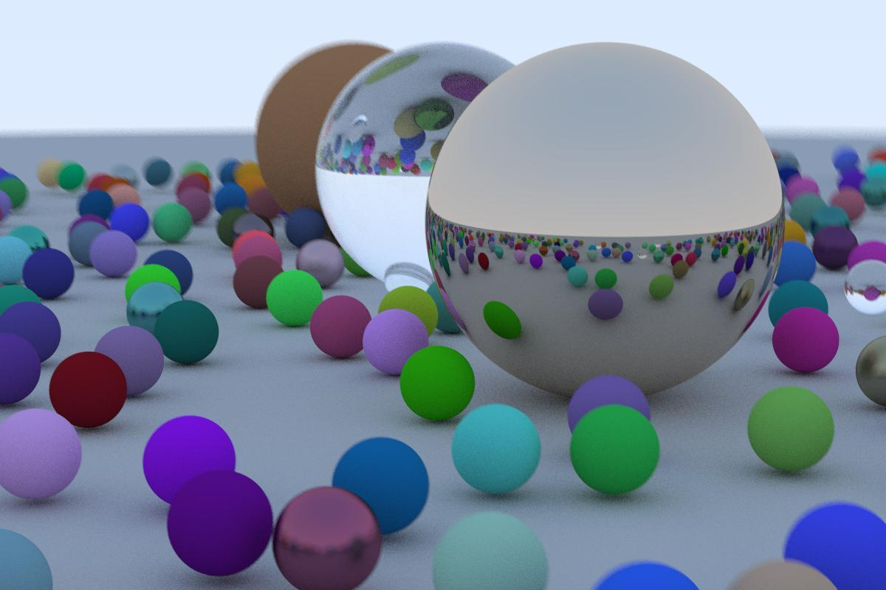

Tr
========

A Go implementation of [_Ray Tracing in One Weekend_](https://raytracing.github.io/books/RayTracingInOneWeekend.html) Peter Shirley.



> Note: Output of the program is in `.ppm` format, which is not supported by many applications. See more about `.ppm` [here](https://en.wikipedia.org/wiki/Netpbm#File_formats)

### Basic

```bash
go build -o Tracer
./Tracer > outputs/image.ppm
```

### Playing With Tracer

Edit `main.go` to play around and generate different renders. 
You may want to edit the camera parameters, add more objects (spheres) to the world or play with equations. I will be adding `docs` later.


## Objects

### Camera 

`cam := InitCamera(lookFrom, lookAt, vup, aspectRatio, fieldOfView , apperture, focalDist)`

| Parameters | Description|
| -------------------| ---------------|
| lookFrom | Vector of dim-3 describing coordinates of camera lens|
| lookAt | Point ( i.e Vector dim-3) where camera is pointed|
|vup | Point defining direction of up direction for camera|
|aspectRatio | Ratio of heigt & width |
|fieldOfView |Camera field of views in degrees|
|apperture| Apperture of the camera lens|
|focalDist|Focal length of camera|

### Materials
- ### Metal
	`mat := NewMetal(Albedo, fuzziness)` , where Albedo is a vector of 3 dimension `(r,g,b)` denoting Albedo (in simpler words, color) of material and fuzziness is a float denoting fuzziness of metal's surface

- ### Lambertian
	`mat := NewLambertian(Albedo)` , where Albedo is a vector of 3 dimension `(r,g,b)` denoting Albedo (in simpler words, color) of material

- ### Dielectric
	Materials like glass, water etc.  
	`mat := NewDielectric(Ir)` , where `Ir` denotes Refractive Index of the material

### Hittable 
- ### Sphere 
`sphr := NewSphere (center, radius, Material)`

|Parameters | Description|
|----------|-----------|
|center| 3 dimensional vector denoting the center of spehere|
|radius| float denotes radius|
|material|`Metal`, `Lambertian` or `Dielectric`|

### Todos / Improvements

- [x] Use miltiple cpu cores while tracing.  
- [ ] Add documentation 
- [x] Add `.jpg` or `.png` support
