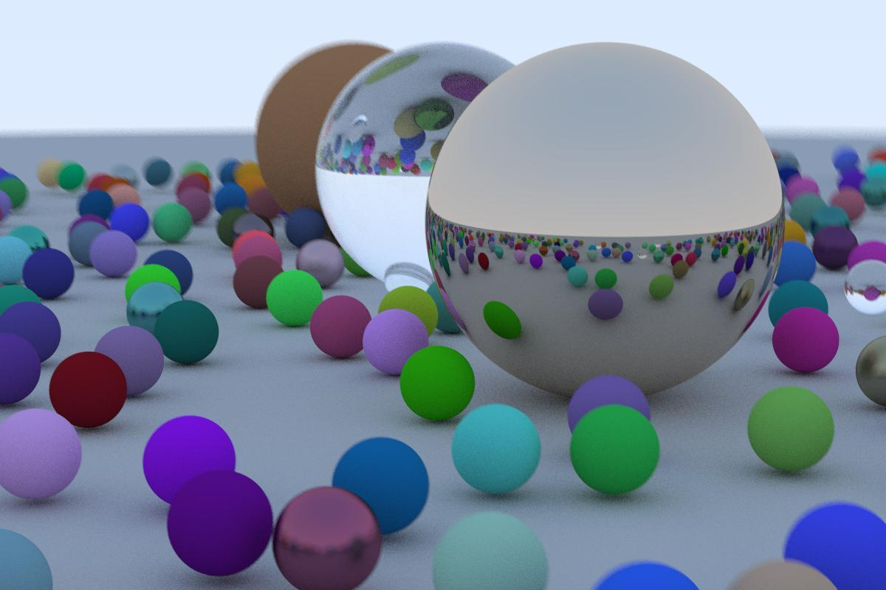

Tr
========

A Go implementation of [_Ray Tracing in One Weekend_](https://raytracing.github.io/books/RayTracingInOneWeekend.html) Peter Shirley.



> Note: Output of the program is in `.ppm` format, which is not supported by many applications. See more about `.ppm` [_here](https://en.wikipedia.org/wiki/Netpbm#File_formats) 

### Basic
```bash
go build -o Tracer
./Tracer > Output.ppm
```

